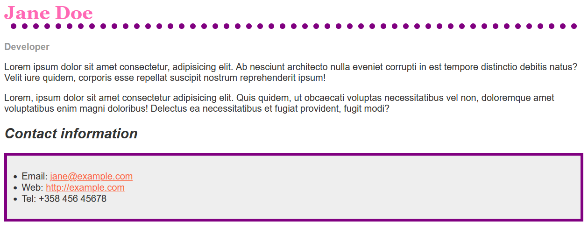

# Exercise 2

> Note: A sample solution is the final folder, however **you are not supposed** to check it, until you try to solve the tasks with your group member.

The file `sarter.html` is a single page that contains both the HTML and the  CSS in the head of the document. 

- Your first task is to move the CSS to a separate file `styles.css`. Hint use Emmet's shortcut: `link`
- Make the following changes in the CSS file:

1. Make the level one heading pink, using the CSS color keyword `hotpink`.
2. Give the heading a 10px dotted border-bottom which uses the CSS color keyword `purple`.
3. Make the level 2 heading italic.
4. Give the `ul` used for the contact details a "background-color" of `#eeeeee`, and a 5px solid purple "border". Use some "padding" to push the content away from the border.
5. Make the links `green` on hover.

You should end up with something like this image.

The CSS properties used are:

- font-family
- color
- border-bottom
- font-weight
- font-size
- font-style
- text-decoration

You can find more information from
- https://www.w3schools.com/CSSref/
- https://developer.mozilla.org/en-US/docs/Web/CSS/Reference

## Credits

https://developer.mozilla.org/en-US/docs/Learn/CSS/First_steps/Using_your_new_knowledge

